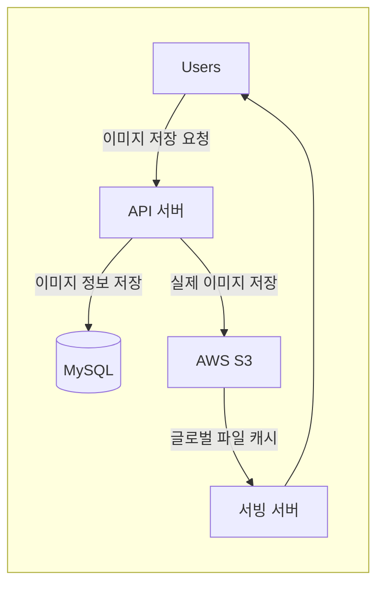

# image-fastapi
이미지를 저장해 주고 서빙하는 API 서버

1. imgbb 와 같은 서비스
2. 이미지를 대신 저장
3. Global CDN 서비스
4. 이미지 조회, 삭제, 저장 기능
5. PNG, JPG 등을 webp로 변환

## 시스템 구조

```mermaid
flowchart LR
    subgraph System[" "]
        U[Users] -->|이미지 저장 요청| API[API 서버]
        API -->|이미지 정보 저장| DB[(MySQL)]
        API -->|실제 이미지 저장| S3[AWS S3]
        S3 -->|글로벌 파일 캐시| CDN[서빙 서버]
        CDN --> U
    end
```
